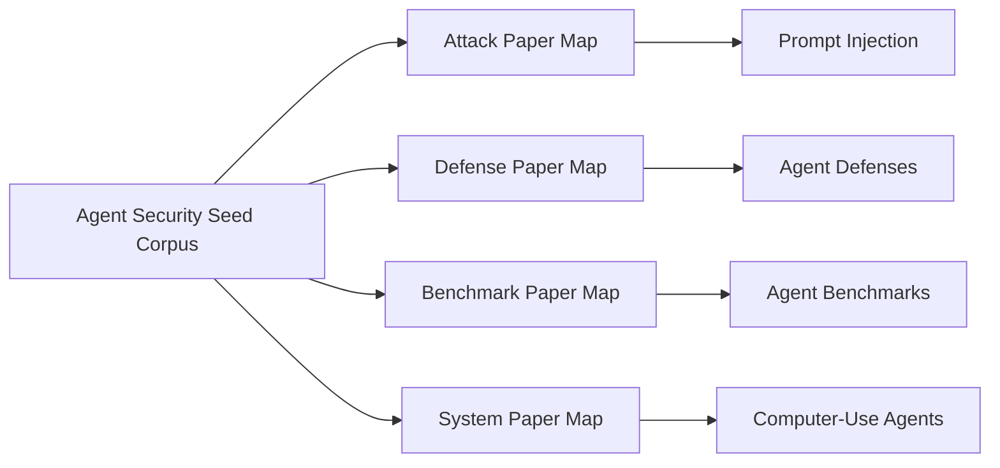

# Agent Security Seed Corpus

## Focus
This map is the first connected view built from the local PDF corpus in `agent-papers`.

## Visual Entry
- Open [Starter Canvas](../../views/canvas/starter.canvas) for a ready-made Obsidian Canvas view.
- Use Obsidian's left sidebar graph icon for the vault-wide graph view.

## Topic Maps
- [[Attack Paper Map]]
- [[Defense Paper Map]]
- [[Benchmark Paper Map]]
- [[System Paper Map]]

## Included Nodes
- [[Prompt Injection]]
- [[Environmental Injection]]
- [[Cross-Modal Injection]]
- [[GUI Agents]]
- [[Web Agents]]
- [[Multimodal Agents]]
- [[Red Teaming]]
- [[Agent Benchmarks]]
- [[Agent Defenses]]
- [[Memory Poisoning]]
- [[Jailbreak Attacks]]
- [[DoS Attacks]]
- [[Multi-Agent Systems]]
- [[Computer-Use Agents]]

## Benchmark and Environment Papers
- [[AgentDojo: A Dynamic Environment to Evaluate Prompt Injection Attacks and Defenses for LLM Agents]]
- [[WebArena: A Realistic Web Environment for Building Autonomous Agents]]
- [[VisualWebArena: Evaluating Multimodal Agents on Realistic Visually Grounded Web Tasks]]
- [[OSWorld: Benchmarking Multimodal Agents for Open-Ended Tasks in Real Computer Environments]]
- [[RedTeamCUA: Realistic Adversarial Testing of Computer-Use Agents in Hybrid Web-OS Environments]]
- [[Hijacking JARVIS: Benchmarking Mobile GUI Agents against Unprivileged Third Parties]]

## Injection and Environment Attack Papers
- [[Not what you've signed up for: Compromising Real-World LLM-Integrated Applications with Indirect Prompt Injection]]
- [[WebInject: Prompt Injection Attack to Web Agents]]
- [[EVA: Red-Teaming GUI Agents via Evolving Indirect Prompt Injection]]
- [[The Obvious Invisible Threat: LLM-Powered GUI Agents' Vulnerability to Fine-Print Injections]]
- [[Manipulating Multimodal Agents via Cross-Modal Prompt Injection]]
- [[Evaluating the Robustness of Multimodal Agents Against Active Environmental Injection Attacks]]
- [[Caution for the Environment: Multimodal LLM Agents are Susceptible to Environmental Distractions]]

## Defense, Poisoning, and DoS Papers
- [[AGENT POISON: Red-teaming LLM Agents via Poisoning Memory or Knowledge Bases]]
- [[AgentSys: Secure and Dynamic LLM Agents Through Explicit Hierarchical Memory Management]]
- [[Breaking Agents: Compromising Autonomous LLM Agents Through Malfunction Amplification]]
- [[AutoDefense: Multi-Agent LLM Defense against Jailbreak Attacks]]
- [[AUTO DAN: Generating Stealthy Jailbreak Prompts on Aligned Large Language Models]]
- [[Denial-of-Service Poisoning Attacks on Large Language Models]]
- [[ThinkTrap: Denial-of-Service Attacks against Black-box LLM Services via Infinite Thinking]]
- [[Red-Teaming LLM Multi-Agent Systems via Communication Attacks]]
- [[UDora: A Unified Red Teaming Framework against LLM Agents by Dynamically Hijacking Their Own Reasoning]]

## Open Questions
- Which nodes deserve full paper-level summaries next?
- Which concepts should become methods or gaps after manual review?
- Where are the strongest cross-links between benchmark papers and attack papers?
